<!-- 
# socially

A new Flutter project.

## Getting Started

This project is a starting point for a Flutter application.

A few resources to get you started if this is your first Flutter project:

- [Lab: Write your first Flutter app](https://flutter.dev/docs/get-started/codelab)
- [Cookbook: Useful Flutter samples](https://flutter.dev/docs/cookbook)

For help getting started with Flutter, view our
[online documentation](https://flutter.dev/docs), which offers tutorials,
samples, guidance on mobile development, and a full API reference. 

-->
<!-- https://www.youtube.com/c/Abhishvek -->
## FIRST => Design credits belongs to [Abhishvek](https://www.youtube.com/c/Abhishvek), so a big thanks for him.

# Socially - Social Media

A social media application made with #FLUTTER, allows users to share their lovely moments and contact with each other.

### Social Media

<a href="https://www.linkedin.com/in/hossam-mohammad-9965791a8/"></a>
<a href="https://twitter.com/hossammo9996"></a>

<!-- ### Donate

<a href="https://www.buymeacoffee.com/frave"></a> -->

## Flutter Packages

- Flutter Provider
- cached_network_image
- custom_navigation_bar
- eva_icons_flutter
- conditional_builder
- font_awesome_flutter
- lottie
- page_transition
- uuid
- timeago

## Next Features

- Stories
- Add Stickers
- Show Last Message
- Show Followers
- Show Following
- Add Settings Page
- Add Person to Person Message

## Commands

```sh
    flutter pub upgrade
```

```
    flutter pub get
```

## Backend

- [Firebase]

---

## Screenshots

<table border>
    <tr>
        <th style="text-align:center">Splash Screen</th>
        <th style="text-align:center">Auth</th>
        <th style="text-align:center">Email Auth</th>
    </tr>
    <tr>
        <td></td>
        <td>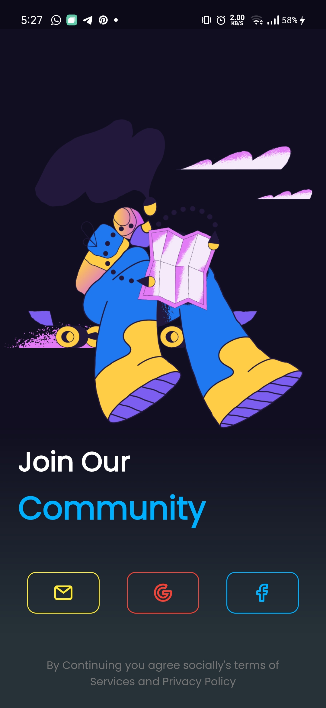</td>
        <td>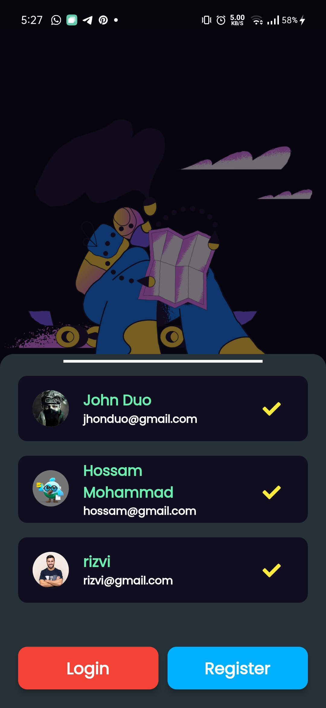</td>
    <tr>
</table>

<table border>
    <tr>
        <th style="text-align:center">Login</th>
        <th style="text-align:center">Show Password</th>
<!--         <th style="text-align:center"></th> -->
    </tr>
    <tr>
        <td></td>
        <td></td>
<!--         <td></td> -->
    <tr>
</table>

<table border>
    <tr>
        <th style="text-align:center">Feeds Screen</th>
        <th style="text-align:center">Feeds Screen</th>
        <th style="text-align:center">Post Options</th>
    </tr>
    <tr>
        <td></td>
        <td>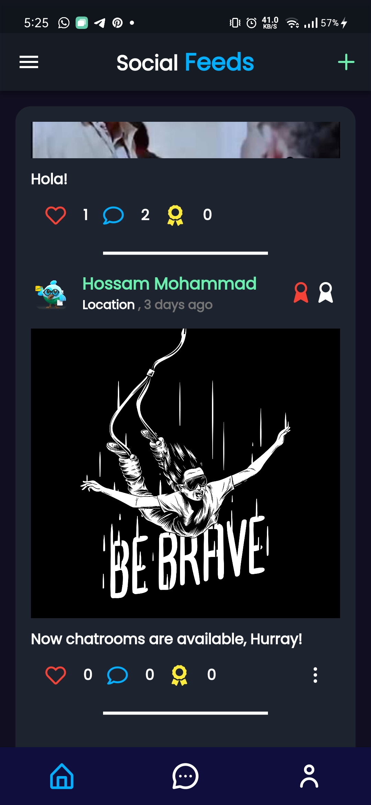</td>
        <td>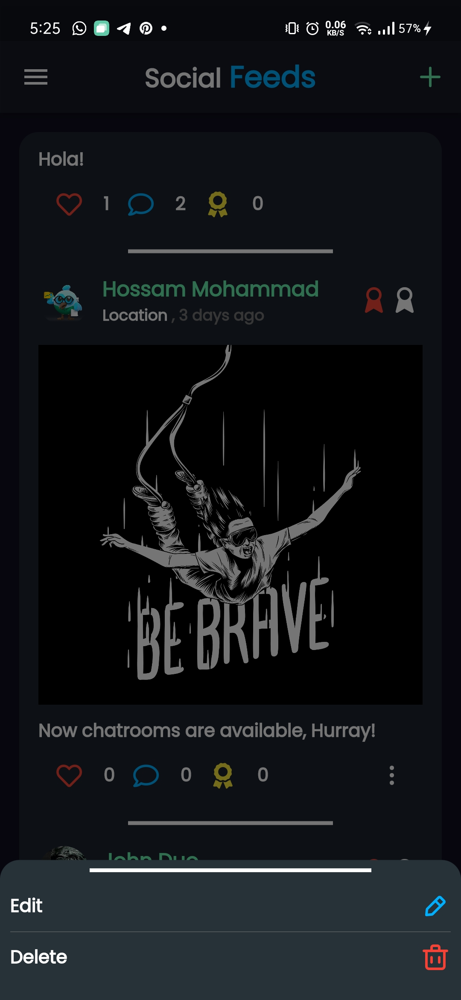</td>
    <tr>
</table>

<table border>
    <tr>
        <th style="text-align:center">Add New Post</th>
        <th style="text-align:center">Add New Post</th>
        <th style="text-align:center">Edit Post</th>
    </tr>
    <tr>
        <td>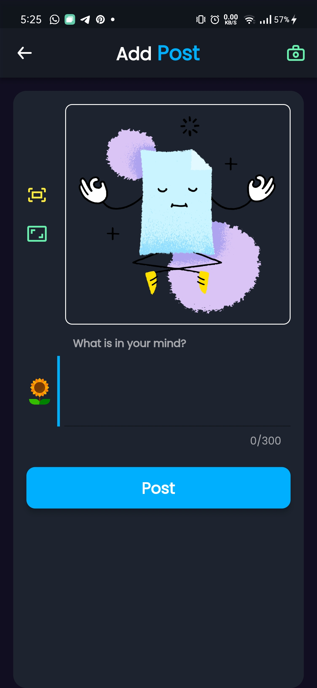</td>
        <td>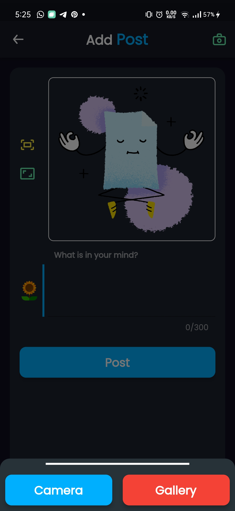</td>
        <td>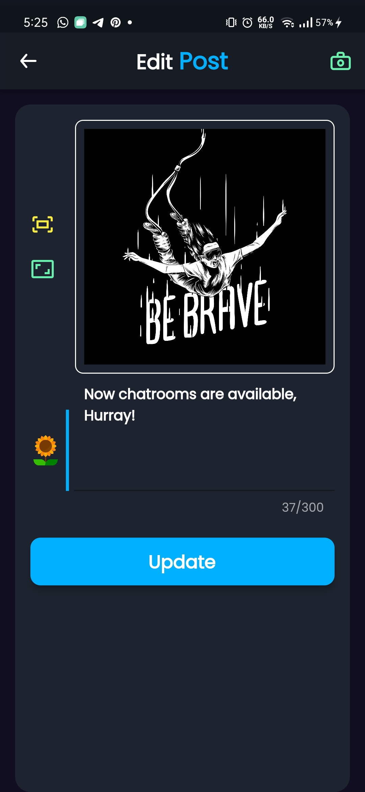</td>
    <tr>
</table>

<table border>
    <tr>
        <th style="text-align:center">Chatrooms</th>
        <th style="text-align:center">Create Chatroom</th>
        <th style="text-align:center">Join Chatroom</th>
    </tr>
    <tr>
        <td>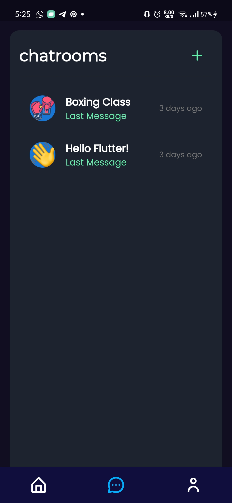</td>
        <td>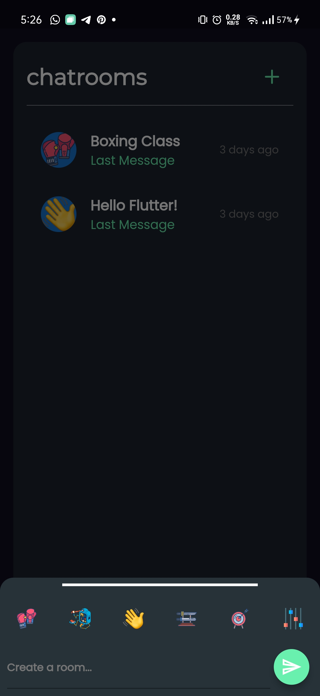</td>
        <td>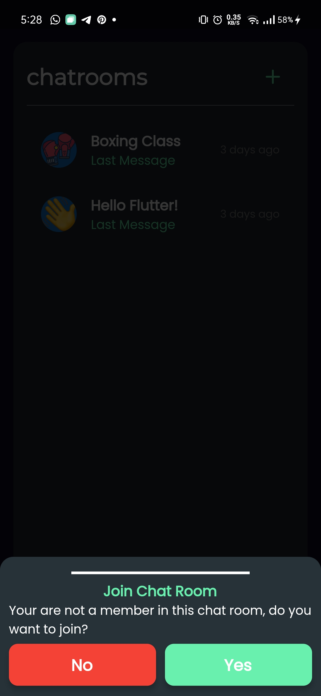</td>
    <tr>
</table>

<table border>
    <tr>
        <th style="text-align:center">Chatroom</th>
        <th style="text-align:center">Chatroom</th>
        <th style="text-align:center">User Profile</th>
    </tr>
    <tr>
        <td></td>
        <td></td>
        <td>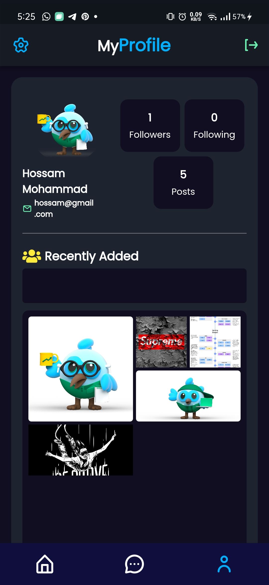</td>
    <tr>
</table>
